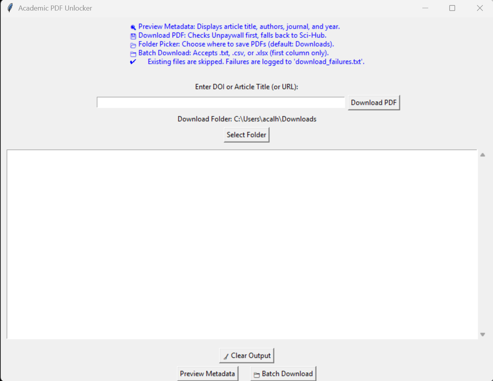

# Academic PDF Unlocker

**Academic PDF Unlocker** is a simple GUI-based tool that helps you locate and download paywalled academic papers using open access sources like Unpaywall and fallback mirrors like Sci-Hub. It supports single DOI/URL lookups or batch input via `.txt`, `.csv`, and `.xlsx` files.



---

## 🔧 Features

- 🖱️ Clean GUI for quick use
- 🔗 Supports DOI or full article URLs
- 📂 Batch mode: Upload `.txt`, `.csv`, or `.xlsx` file with DOIs/URLs
- 📥 Automatic fallback to open access and Sci-Hub mirrors
- 🧠 Automatically detects column headers
- 💬 Output log viewable in-app
- 📊 Progress bar for batch downloads
- 🖼️ Custom app icon
- ✔️ Digitally signed EXE installer

---

## 📦 Installation

### From Installer
1. Download and run the latest release `.exe` from [Releases](https://github.com/YOUR_USERNAME/AcademicPDFUnlocker/releases)
2. Follow the installer prompts
3. Use the desktop shortcut or Start Menu entry

### From Source
1. Clone this repo:
   ```bash
   git clone https://github.com/AlanCalhoun/AcademicPDFUnlocker.git
   cd AcademicPDFUnlocker
